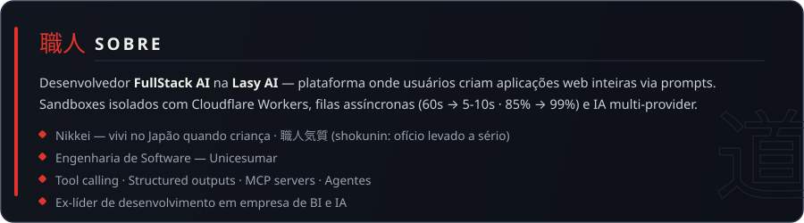

## ⛩️ Em produção

Produtos vivos em que trabalho ou construí — abre e usa:

| Produto | O que é |
|---|---|
| 🧠 [Lasy AI](https://lasy.ai) | Plataforma onde usuários criam aplicações web inteiras com IA — trabalho aqui como FullStack AI (sandboxes, filas, multi-provider) |
| 🤖 [Lasy Agent](https://agent.lasy.ai/lp) | Funcionários de IA pra pequenos negócios: atendimento, agenda e cobrança pelo WhatsApp |
| 💳 [VyntrixPay](https://vyntrixpay.com) | Gateway de pagamentos inteligente: cartão, Pix, boleto, antifraude e conciliação automática |
| 🔮 [Vedic](https://appvedic.com) | App de compatibilidade afetiva por astrologia védica — swipe, match e mapa de sinastria |
| 🏷️ [PromoBot](https://ofertasbot.com) | Monitora Kabum e Terabyte 24/7 e posta ofertas no Telegram já com link de afiliado |
| 📚 [eBookGenerator](https://ebookgenerator.dev) | SaaS de geração de eBooks com IA (Claude + structured outputs) |
| 🌐 [rodrigosumioshi.com](https://rodrigosumioshi.com) | Meu portfólio |

> Código fechado — produto em operação. Open source: [whatsapp-automation](https://github.com/sumioshi/whatsapp-automation) · estudos antigos em [sumioshi-vault](https://github.com/sumioshi-vault)

## 🗻 Vida em commits

<picture>
  <source media="(prefers-color-scheme: dark)" srcset="https://raw.githubusercontent.com/sumioshi/sumioshi/output/github-snake.svg" />
  <source media="(prefers-color-scheme: light)" srcset="https://raw.githubusercontent.com/sumioshi/sumioshi/output/github-snake-light.svg" />
  
</picture>

## 📫 Contato

  

七転び八起き — cai sete vezes, levanta oito

