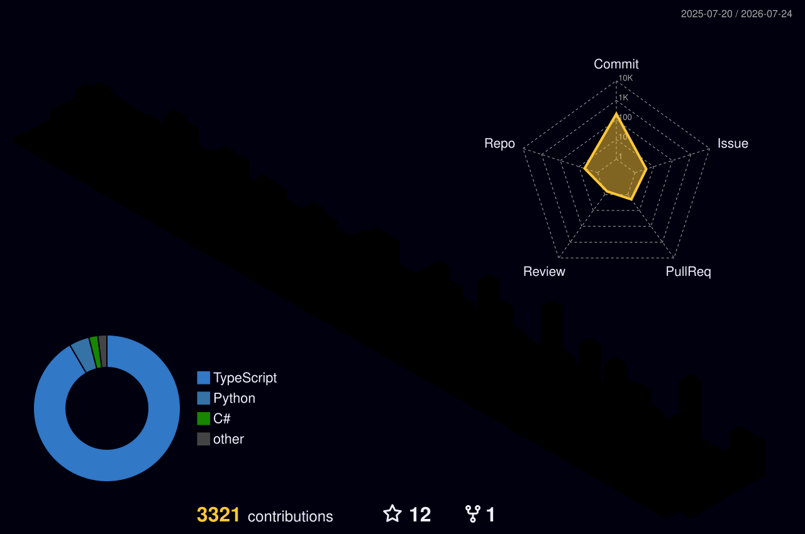

## 🧠 Sobre

Desenvolvedor **FullStack AI** na [Lasy AI](https://lasy.ai) — plataforma onde usuários criam aplicações web inteiras através de prompts. Meu dia a dia: arquitetura de **sandboxes isolados** com Cloudflare Workers, **processamento assíncrono** com filas (60s → 5-10s, 85% → 99% de sucesso) e integração com **Anthropic, OpenAI e Gemini**.

- 🎓 Engenharia de Software — Unicesumar
- 🤖 Tool calling · Structured outputs · MCP servers · Agentes
- 🛠️ Ex-líder de desenvolvimento em empresa de BI e IA

## ⚡ Stack

**Frontend**

**Backend**

**Cloud & DevOps**

## 🚀 Projetos em destaque

| Projeto | O que é |
|---|---|
| 📱 [whatsapp-automation](https://github.com/sumioshi/whatsapp-automation) | Coletor 24/7 de conteúdo de grupos de WhatsApp (áudio, vídeo, imagem, texto) via Baileys |
| 🗄️ [mcp-mssql](https://github.com/sumioshi/mcp-mssql) | MCP server para SQL Server — assistentes de IA falando com banco de dados com segurança |
| 🎨 [ig-content-pipeline](https://github.com/sumioshi/ig-content-pipeline) | Pipeline de geração de conteúdo para Instagram com IA |
| 📚 [eBookGenerator](https://ebookgenerator.dev) | SaaS de geração de eBooks com IA (Claude + structured outputs), em produção |
| 💪 [SuppliFIT](https://github.com/sumioshi/SuppliFIT) | Plataforma de passe de suplementos |
| ☕ [springboot-livros](https://github.com/sumioshi/springboot-livros) | API REST em Java + Spring Boot |

> 📁 Estudos e projetos de curso moram em [sumioshi-vault](https://github.com/sumioshi-vault) — histórico preservado, perfil limpo.

## 🐍 A cobra come meus commits

<picture>
  <source media="(prefers-color-scheme: dark)" srcset="https://raw.githubusercontent.com/sumioshi/sumioshi/output/github-snake.svg" />
  <source media="(prefers-color-scheme: light)" srcset="https://raw.githubusercontent.com/sumioshi/sumioshi/output/github-snake-light.svg" />
  
</picture>

## 🏙️ Contribuições em 3D

## 📊 Stats

## 📫 Contato

